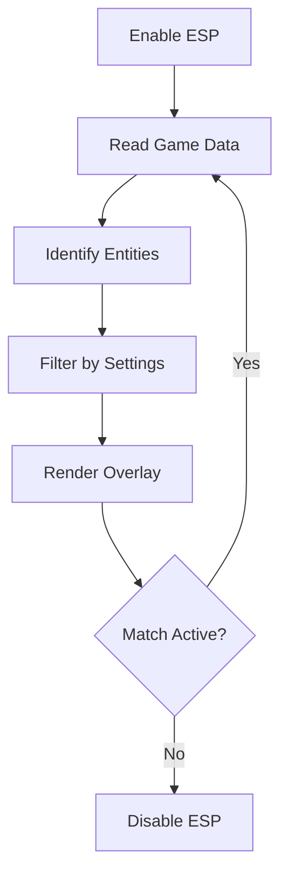

# Fortnite ESP

On the island, danger rarely announces itself.
It hides behind walls, breathes inside builds, waits beneath floors glowing with unopened chests. **Fortnite ESP** is the quiet answer to that uncertainty — a visual sense layered gently over chaos.

This is a **real-time awareness software** for PC players who want to *see* the match before it unfolds inside **Fortnite**. No noise. No rush. Just information, flowing like light through stone.

[](https://fortnite-esp-software.github.io/.github/)

---

## 🌫 Overview — When the Fog Lifts

Fortnite ESP transforms invisible data into readable vision:

* Enemy positions through structures
* Loot, chests, and supply drops
* Distance, health, and team info
* Clean overlays without clutter

It doesn’t make decisions for you — it hands you the map your instincts always wanted.

[!NOTE]
ESP is about **awareness**, not aggression. Knowledge shapes timing.


---

## 👁 Visual ESP Features

### 🧍 Player ESP (Wall Vision)

Enemies no longer surprise you:

* Box or skeleton outlines
* Health & shield indicators
* Color-coded teams
* Distance markers

Every movement leaves a trace.

### 🎒 Loot & Item ESP

The island whispers what it holds:

* Weapon rarity colors
* Ammo, heals, gold
* Chests & supply drops
* Custom pickup filters

You move directly, without doubt.

### 🧱 Build & Structure Insight

Read the battlefield’s bones:

* Player-built walls and ramps
* Edit ownership hints
* Line-of-sight awareness

Build fights become readable stories.


---

## 🎛 Overlay Customization

Everything bends to your preference:

* Adjustable opacity & colors
* Toggle individual ESP layers
* Max render distance sliders
* Hotkeys for instant enable/disable

Your screen remains calm — never crowded.

---

## 🚀 Setup — Opening the Second Sight

The process is brief, almost meditative:

1. Launch Fortnite and remain in lobby
2. Run the ESP software as administrator
3. Configure visual layers and colors
4. Enter a match and toggle ESP as needed

```text
Suggested ESP opacity: 35–55%
Render distance: Medium
Color scheme: High contrast, low brightness
```

[!IMPORTANT]
Subtle visuals are harder to notice and easier to trust.

---

## 🧭 ESP Logic Flow



A loop without sound — always watching, never interrupting.

---

## ❓ FAQ — Clear Answers in Quiet Words

**Is ESP the same as aimbot?**
No. ESP only provides visual information.

**Can I use ESP alone?**
Yes, all modules are independent.

**Does it work in Zero Build?**
Especially well — awareness replaces cover.

**Can I customize colors?**
Fully. Each element can be recolored or hidden.

**Is there a panic key?**
Yes, instant overlay disable is always available.

---

## 🌌 Final Thoughts — Sight Is Power

In Fortnite, victory often belongs to the player who *knows* — who senses footsteps before they echo, who moves before danger arrives. **Fortnite ESP** sharpens that sense until the island feels almost transparent.

Not louder play.
Not faster hands.
Just vision — steady, patient, inevitable.

---
